# MVP — Engenharia de Dados
## Pipeline de dados na nuvem: utilização e custo assistencial na saúde suplementar brasileira

**Autor:** Isaías S. Cordeiro
**Curso:** Pós-graduação em Ciência de Dados e Analytics — PUC-Rio
**Sprint:** Engenharia de Dados
**Plataforma:** Databricks Free Edition
**Fonte:** Agência Nacional de Saúde Suplementar (ANS) — Portal de Dados Abertos

---

## Índice

1. [Contexto de Negócios e Perguntas (Etapa 2 e 4.1)](#1-contexto-de-negócios-e-perguntas-etapa-2-e-41)
2. [Carga dos Dados (Etapa 4.2)](#2-carga-dos-dados-etapa-42)
3. [Modelagem e Catálogo de Dados (Etapa 4.3)](#3-modelagem-e-catálogo-de-dados-etapa-43)
4. [Pipeline de Dados (Etapa 4.4)](#4-pipeline-de-dados-etapa-44)
5. [Qualidade de Dados (Etapa 4.5)](#5-qualidade-de-dados-etapa-45)
6. [Análise de Dados (Etapa 4.5)](#6-análise-de-dados-etapa-45)
7. [Autoavaliação](#7-autoavaliação)

---

# 1. Contexto de Negócios e Perguntas (Etapa 2 e 4.1)

## Problema

Operadoras de planos de saúde e administradoras de benefícios enfrentam uma decisão recorrente: quais serviços manter, ampliar ou descontinuar em suas carteiras. Essa decisão costuma ser tomada com dados internos, sem referência externa de mercado — o gestor sabe quanto o próprio produto odontológico é utilizado, mas não sabe se esse patamar está acima ou abaixo do setor.

O problema deste MVP é a **ausência de um benchmark estruturado de utilização e custo assistencial na saúde suplementar brasileira**. Os dados existem, são públicos e são obrigatórios por regulação, mas chegam em arquivos brutos, trimestrais e estruturalmente irregulares, o que inviabiliza consulta direta.

Este trabalho constrói o pipeline que transforma esses arquivos em um modelo consultável, capaz de responder perguntas de frequência de utilização, custo unitário e evolução temporal por tipo de serviço, perfil de operadora e canal de contratação.

## Continuidade com trabalho anterior

Em MVP anterior (sprint de Machine Learning) foi analisada a relação entre serviços de valor agregado e retenção de clientes, identificando quais serviços mais reduziam o churn. Aquele trabalho respondeu **quais serviços retêm**. Este responde **quais serviços são efetivamente utilizados, a que custo e com que evolução** — a contraparte operacional da mesma questão de negócio, agora com dado público brasileiro.

## Perguntas de negócio

### Bloco A — Estrutura de mercado

1. Quais são as principais operadoras do mercado brasileiro por volume de beneficiários, e como esse volume se distribui por modalidade e UF?
2. O mercado é concentrado ou pulverizado? Como isso varia por região?

### Bloco B — Utilização de serviços

3. Quais tipos de evento assistencial concentram o maior volume de utilização?
4. Qual a frequência de utilização por beneficiário exposto em cada tipo de evento?
5. A frequência de utilização difere entre modalidades de operadora?
6. Exames de imagem e exames laboratoriais apresentam padrões de utilização distintos?

### Bloco C — Custo

7. Qual o custo médio assistencial por evento, e como se distribui entre os tipos de serviço?
8. Existe ganho de escala? Operadoras de maior porte apresentam custo por beneficiário menor?

### Bloco D — Comportamento temporal

9. Existe padrão de evolução na utilização de serviços ao longo do período?
10. Como a utilização evoluiu nos últimos períodos disponíveis?

### Bloco E — Serviços digitais

11. Qual o volume de utilização de telemedicina/telessaúde na saúde suplementar brasileira?

> **Nota metodológica:** as perguntas 1, 2 e 11 foram mantidas deliberadamente, ainda que não respondidas. A investigação das fontes públicas indicou que o SIP não identifica operadoras individualmente e que a ANS trata telessaúde como modalidade de atendimento, sem registro estatístico próprio. As implicações estão discutidas na Autoavaliação.

## Fonte de dados

**Agência Nacional de Saúde Suplementar (ANS) — Portal de Dados Abertos**
`https://dadosabertos.ans.gov.br/FTP/PDA/SIP/`

A ANS é a agência reguladora do setor de saúde suplementar no Brasil. As operadoras têm obrigação legal de reportar periodicamente dados assistenciais e financeiros, o que confere à base cobertura censitária do setor regulado.

O conjunto utilizado é o **SIP — Sistema de Informações de Produtos**, que reúne dados agregados trimestrais dos eventos em saúde — consultas, atendimentos ambulatoriais, exames, terapias, internações e procedimentos odontológicos — por perfil de operadora e tipo de contratação, acompanhados da quantidade de beneficiários fora do período de carência e da despesa assistencial líquida.

### Estrutura dos dados brutos

**Formato:** CSV · separador `;` · encoding UTF-8 · decimal com vírgula em valores monetários e ponto em quantidades · qualificador de texto por aspas duplas.

**Cobertura:** 24 arquivos trimestrais, de 2020-01 a 2025-10.

**Grão:** porte × modalidade × cobertura × contratação × trimestre × item assistencial.

| Coluna | Tipo | Descrição |
|---|---|---|
| `PORTE_OPERADORA` | texto | Porte da operadora: pequeno, médio ou grande |
| `GR_MODALIDADE` | texto | Modalidade: autogestão, cooperativa médica, cooperativa odontológica, filantropia, medicina de grupo, odontologia de grupo, seguradora |
| `COBERTURA` | texto | Médico-hospitalar ou odontológico |
| `ID_TRIMESTRE` | texto | Competência no formato AAAA-MM |
| `CONTRATACAO` | texto | Individual ou familiar, coletivo empresarial, coletivo por adesão |
| `ID_ITEM_ASST` | texto | Código hierárquico do item assistencial |
| `DE_ITEM_ASST` | texto | Descrição do item assistencial |
| `QT_EVENTOS` | numérico | Quantidade de eventos realizados |
| `QT_BENEF_FORA_CARENCIA` | numérico | Beneficiários aptos a utilizar o serviço |
| `VL_DESPESA_ASST_LIQ` | numérico | Despesa assistencial líquida |
| `DT_CORTE` | data | Data de extração dos dados pela ANS |

**Volume:** 156.792 registros no conjunto completo.

## Licença de uso

Os dados são publicados pela ANS no Portal Brasileiro de Dados Abertos, no âmbito da Política de Dados Abertos do Poder Executivo Federal (Decreto nº 8.777/2016) e da Lei de Acesso à Informação (Lei nº 12.527/2011).

São de uso livre para qualquer finalidade, incluindo comercial e acadêmica, exigindo-se a citação da fonte. Não há necessidade de cadastro, autenticação ou solicitação prévia de acesso.

**Citação adotada:** BRASIL. Agência Nacional de Saúde Suplementar. Portal de Dados Abertos — Sistema de Informações de Produtos (SIP). Disponível em: https://dadosabertos.ans.gov.br/FTP/PDA/SIP/. Acesso em: setembro de 2026.

Não há dados pessoais na base utilizada. Todos os registros são agregados por perfil de operadora, sem qualquer informação identificável de beneficiário ou de operadora individual — o que dispensa tratamento de anonimização.

---

# 2. Carga dos Dados (Etapa 4.2)

## Estratégia de coleta

A coleta ocorre diretamente do servidor HTTP da ANS, sem download manual intermediário. O notebook percorre as 24 competências, lê cada arquivo e persiste o conjunto empilhado em tabela Delta.

```python
COMPETENCIAS = [f"{ano}{tri}" for ano in range(2020, 2026)
                              for tri in ["01","04","07","10"]]

partes = []
for comp in COMPETENCIAS:
    arq = f"sip_mapa_assistencial_{comp}.csv"
    d = pd.read_csv(BASE + "SIP/" + arq, **LEITURA)
    d["_arquivo_origem"] = arq
    d["_data_ingestao"]  = pd.Timestamp.now()
    partes.append(d)

pdf = pd.concat(partes, ignore_index=True)

(spark.createDataFrame(pdf)
      .write.format("delta").mode("overwrite")
      .saveAsTable("bronze.sip"))
```

## Decisões da camada de ingestão

| Decisão | Justificativa |
|---|---|
| Leitura direta da URL | Elimina etapa manual e torna o notebook reprodutível de ponta a ponta |
| `dtype=str` — nenhuma conversão | Conversão é interpretação, e interpretação pertence à silver. Preserva zeros à esquerda em códigos de tamanho fixo |
| `encoding="utf-8"` | Definido por inspeção. A ANS não adota encoding único — o cadastro de operadoras usa ISO-8859-1 |
| Metadados `_arquivo_origem` e `_data_ingestao` | Rastreabilidade de procedência e auditoria temporal |
| Tabela única empilhada | Viabilizado pela estabilidade de esquema verificada. A alternativa de 24 tabelas exigiria `UNION` em toda consulta temporal |
| `mode("overwrite")` | Idempotência: reexecução produz resultado idêntico, sem duplicar registros |
| Estrutura da fonte preservada | Nenhuma agregação ou filtro é aplicado antes da persistência |

> **Orientação recebida do professor:** agregação durante a ingestão descaracteriza a camada bronze, pois altera a estrutura dos dados da fonte. Para restrições de volume, o correto é limitar em linhas sem mexer na estrutura. A implementação atende a essa orientação.

## Evidência

**Estrutura persistida no Unity Catalog**

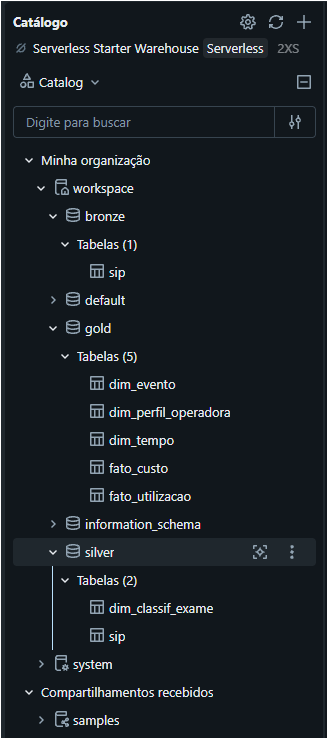

**Ingestão das 24 competências**

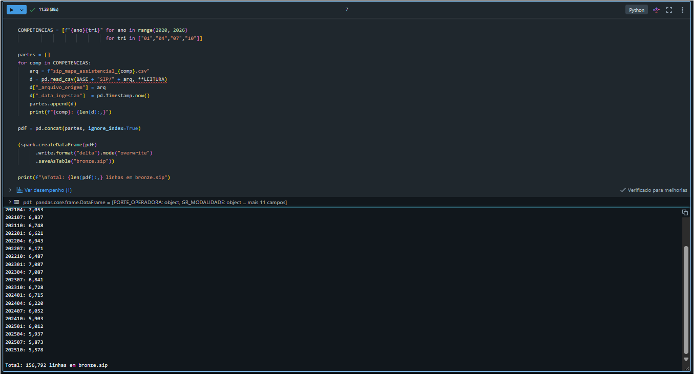

**Conferência de volume por arquivo de origem**

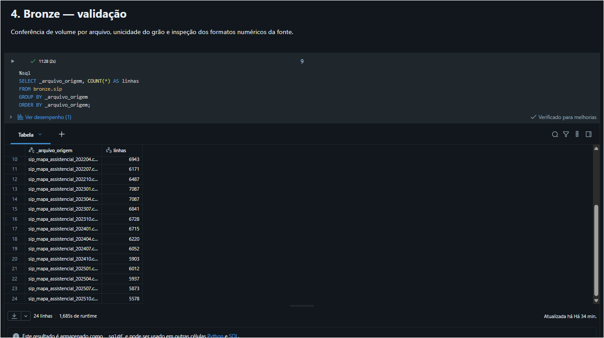

---

# 3. Modelagem e Catálogo de Dados (Etapa 4.3)

## Modelo adotado

**Esquema estrela**, com duas tabelas fato e três dimensões conformadas.

```
                    gold.dim_tempo (24)
                            │
gold.dim_evento (123) ──────┼────── gold.fato_custo (9.004)
                            │
gold.dim_perfil_operadora (82) ──── gold.fato_utilizacao (145.338)
```

**Justificativa da escolha:** a carga é em lote, imutável e sem necessidade de integridade transacional. O esquema estrela prioriza desempenho de leitura analítica e clareza semântica sobre economia de armazenamento. A alternativa normalizada (3FN) otimizaria escrita, que não é requisito aqui; o floco de neve normalizaria dimensões já pequenas, encarecendo as consultas sem ganho relevante.

## Por que duas tabelas fato

A tabela de origem acomoda **duas granularidades de medida**. O campo `ID_ITEM_ASST` é hierárquico, com até quatro níveis separados por ponto:

```
C          EXAMES                          nível 1
C.02       TOMOGRAFIA COMPUTADORIZADA      nível 2
C.10.01    MAMOGRAFIA (50 A 69 ANOS)       nível 3
E1.04.02.01  UTI NEONATAL ATÉ 48H          nível 4
```

Despesa e beneficiários expostos são reportados **apenas no nível 1**; a quantidade de eventos é reportada em todos os níveis. Modelar em tabela única exigiria descartar 80% das linhas ou conviver com medidas majoritariamente nulas.

| Fato | Grão | Medidas |
|---|---|---|
| `fato_custo` | Nível 1, exceto itens E1 e E2 | Eventos, beneficiários expostos, despesa |
| `fato_utilizacao` | Níveis 2, 3 e 4 | Eventos |

## Catálogo de dados

### `gold.dim_tempo`

Dimensão temporal derivada do campo de competência. Grão: uma linha por trimestre. 24 registros.

| Coluna | Tipo | Descrição | Domínio | Linhagem |
|---|---|---|---|---|
| `SK_TEMPO` | texto | Chave da competência | 2020-01 a 2025-10 | `silver.sip.ID_TRIMESTRE` |
| `NR_ANO` | inteiro | Ano da competência | 2020 a 2025 | Derivado: 4 primeiros caracteres |
| `NR_MES_COMPETENCIA` | inteiro | Mês de referência | 1, 4, 7, 10 | Derivado: caracteres 6-7 |
| `NR_TRIMESTRE` | inteiro | Trimestre do ano | 1 a 4 | Derivado do mês |

### `gold.dim_evento`

Dimensão de item assistencial, com atributos derivados de classificação. Grão: uma linha por item. 123 registros.

| Coluna | Tipo | Descrição | Domínio | Linhagem |
|---|---|---|---|---|
| `SK_EVENTO` | texto | Código do item assistencial | A a I, com subníveis | `silver.sip.ID_ITEM_ASST` |
| `DS_EVENTO` | texto | Descrição do item | 123 valores | `silver.sip.DE_ITEM_ASST` |
| `NIVEL` | inteiro | Profundidade hierárquica | 1 a 4 | Derivado: contagem de separadores |
| `CD_GRUPO` | texto | Grupo assistencial | A, B, C, D, E, F, G, H, I | Derivado: primeiro caractere |
| `TP_NATUREZA` | texto | Natureza do item | SERVICO (103), AGRAVO (20) | Derivado: grupos F e G são agravos |
| `LG_ITEM_SEM_DESPESA` | booleano | Item sem despesa por definição | true para E1 e E2 | Derivado |
| `CLASSIF_EXAME` | texto | Natureza diagnóstica do exame | IMAGEM (12), LABORATORIAL (3), ENDOSCOPICO (3), FUNCIONAL (2) | Dimensão derivada autoral — ver nota |

> **Nota sobre `CLASSIF_EXAME`:** a ANS não classifica exames por natureza diagnóstica — o nível 2 do item C desce diretamente ao procedimento. A classificação é **autoral**, atribuída a partir da descrição de cada procedimento, e não consta da fonte original. As categorias ENDOSCOPICO e FUNCIONAL foram criadas para evitar enquadramento forçado de procedimentos que não são nem imagem nem laboratório (colonoscopia, teste ergométrico, Holter). A prática foi validada com o professor responsável, que confirmou sua adequação desde que a dimensão derivada seja construída a partir da camada silver, preservando-se a estrutura da fonte na bronze.

### `gold.dim_perfil_operadora`

Dimensão de perfil, derivada dos atributos degenerados da tabela de origem. Grão: uma linha por combinação. 82 registros.

| Coluna | Tipo | Descrição | Domínio | Linhagem |
|---|---|---|---|---|
| `SK_PERFIL` | texto | Chave composta concatenada | 82 combinações | Derivado: concatenação dos 4 atributos |
| `PORTE_OPERADORA` | texto | Porte | Pequeno, médio, grande | `silver.sip` |
| `GR_MODALIDADE` | texto | Modalidade | 7 valores | `silver.sip` |
| `COBERTURA` | texto | Tipo de cobertura | Médico-hospitalar, odontológico | `silver.sip` |
| `CONTRATACAO` | texto | Canal de contratação | Individual ou familiar, coletivo empresarial, coletivo por adesão | `silver.sip` |

> As 82 combinações observadas correspondem a menos que as 126 teoricamente possíveis. As 44 ausentes refletem configurações inexistentes no mercado — cooperativa odontológica em cobertura médico-hospitalar, por exemplo. Trata-se de característica do setor, não de lacuna de dados.

### `gold.fato_custo`

Fato de custo assistencial. Grão: nível 1 × trimestre × perfil. 9.004 registros.

| Coluna | Tipo | Descrição | Aditividade |
|---|---|---|---|
| `SK_TEMPO` | texto | FK para `dim_tempo` | — |
| `SK_EVENTO` | texto | FK para `dim_evento` | — |
| `SK_PERFIL` | texto | FK para `dim_perfil_operadora` | — |
| `QT_EVENTOS` | decimal | Quantidade de eventos | Aditiva |
| `QT_BENEF_FORA_CARENCIA` | decimal | Beneficiários aptos a utilizar | Semiaditiva — ver nota |
| `VL_DESPESA_ASST_LIQ` | decimal | Despesa assistencial líquida | Aditiva |

### `gold.fato_utilizacao`

Fato de utilização detalhada. Grão: níveis 2 a 4 × trimestre × perfil. 145.338 registros.

| Coluna | Tipo | Descrição | Aditividade |
|---|---|---|---|
| `SK_TEMPO` | texto | FK para `dim_tempo` | — |
| `SK_EVENTO` | texto | FK para `dim_evento` | — |
| `SK_PERFIL` | texto | FK para `dim_perfil_operadora` | — |
| `QT_EVENTOS` | decimal | Quantidade de eventos | Aditiva |

> **Nota sobre aditividade:** `QT_BENEF_FORA_CARENCIA` representa a exposição do grupo de beneficiários, não de cada serviço isoladamente, repetindo-se entre itens de um mesmo perfil e competência. Métricas derivadas — frequência de utilização, custo por beneficiário — são **não aditivas**: devem ser recalculadas a cada nível de agregação, somando numerador e denominador antes da divisão, e nunca somadas ou promediadas.

## Evidência

**Construção das dimensões conformadas**

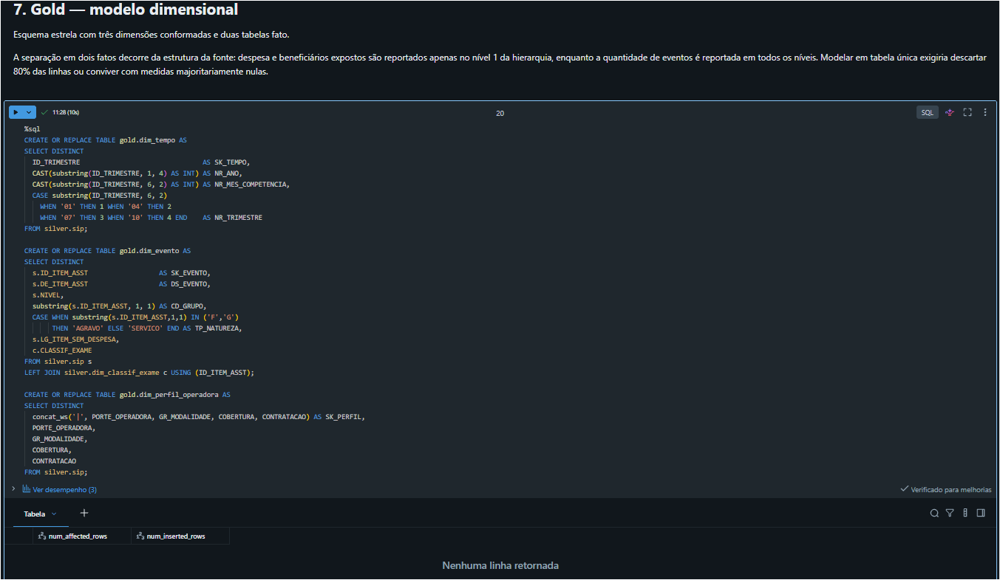

**Catálogo das tabelas da camada gold**

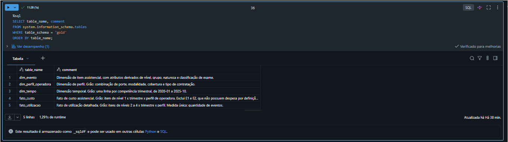

**Catálogo nível-coluna — dimensão de evento**

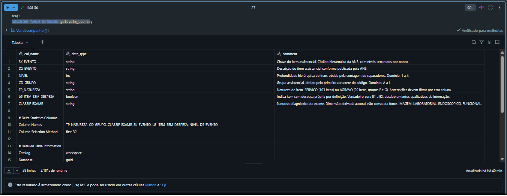

**Catálogo nível-coluna — fato de custo**

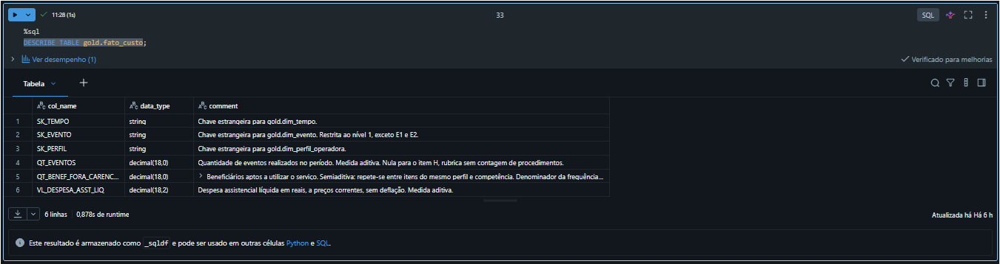

**Unicidade das chaves dimensionais**

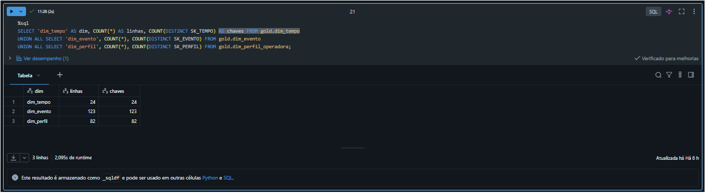

**Integridade referencial**

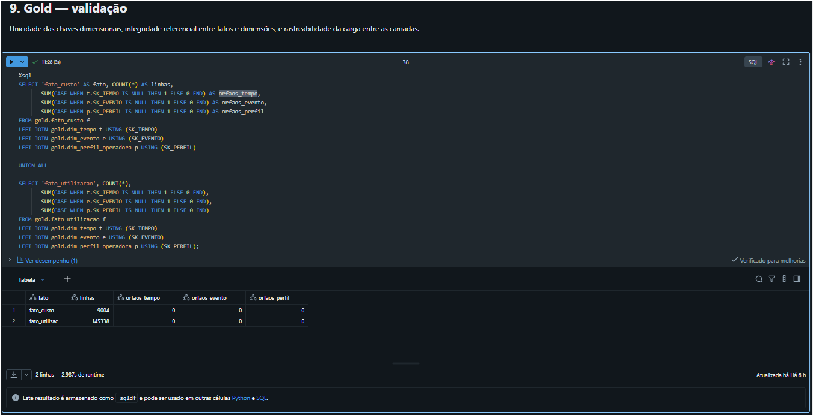

---

# 4. Pipeline de Dados (Etapa 4.4)

## Organização

O pipeline segue a arquitetura medalhão, com um notebook por etapa.

| Notebook | Responsabilidade |
|---|---|
| `00_exploracao` | Inspeção inicial das fontes. Não integra o fluxo de produção |
| `MVP_IsaiasCordeiro` | Pipeline completo: ingestão, transformação, modelagem, catálogo, qualidade e análise |

O fluxo de produção foi desenvolvido em notebook único, estruturado em onze seções que acompanham as camadas da arquitetura medalhão, cada uma encerrada por sua própria validação — controle de qualidade em posto de trabalho, e não inspeção final.

**Justificativa da escolha:** a opção por arquivo único é adequada ao escopo deste MVP — trabalho individual, volume que permite reexecução completa em poucos minutos e avaliação por leitura sequencial. Em ambiente produtivo, a ramificação por camada seria preferível, permitindo reexecução isolada de cada etapa, orquestração com retry independente e edição concorrente. A decisão é de escopo, não de desconhecimento do padrão de mercado.

O notebook de exploração foi mantido no repositório por registrar a investigação que fundamentou as decisões de modelagem, mas está identificado como fora do fluxo de produção.

## Transformações da camada silver

| # | Transformação | Motivo | Origem |
|---|---|---|---|
| 1 | Conversão numérica por coluna | Despesa usa vírgula decimal; quantidade usa ponto | QD-12 |
| 2 | Criação de `NIVEL` | Hierarquia embutida no identificador | QD-03 |
| 3 | Sinalização `LG_ITEM_SEM_DESPESA` | Itens E1 e E2 não possuem despesa por definição | QD-05 |
| 4 | Conversão de datas | Tipagem postergada da bronze | DT-04 |
| 5 | Dimensão `dim_classif_exame` | Fonte não classifica exames por natureza | QD-06 |

```sql
CREATE OR REPLACE TABLE silver.sip AS
SELECT
  PORTE_OPERADORA, GR_MODALIDADE, COBERTURA, CONTRATACAO,
  ID_TRIMESTRE, ID_ITEM_ASST, DE_ITEM_ASST,

  size(split(ID_ITEM_ASST, '\\.')) AS NIVEL,

  CASE WHEN ID_ITEM_ASST IN ('E1','E2') THEN true ELSE false END
    AS LG_ITEM_SEM_DESPESA,

  CAST(QT_EVENTOS AS DECIMAL(18,0))              AS QT_EVENTOS,
  CAST(QT_BENEF_FORA_CARENCIA AS DECIMAL(18,0))  AS QT_BENEF_FORA_CARENCIA,
  CAST(replace(VL_DESPESA_ASST_LIQ, ',', '.') AS DECIMAL(18,2))
                                                 AS VL_DESPESA_ASST_LIQ,
  CAST(DT_CORTE AS DATE) AS DT_CORTE,
  _arquivo_origem, _data_ingestao
FROM bronze.sip;
```

## Transformações da camada gold

As dimensões são extraídas por `SELECT DISTINCT` sobre os atributos degenerados da silver. As fatos são obtidas por filtro de nível hierárquico, com as chaves estrangeiras construídas a partir dos mesmos campos que originam as dimensões — o que garante integridade referencial por construção.

```sql
CREATE OR REPLACE TABLE gold.fato_custo AS
SELECT
  ID_TRIMESTRE AS SK_TEMPO,
  ID_ITEM_ASST AS SK_EVENTO,
  concat_ws('|', PORTE_OPERADORA, GR_MODALIDADE, COBERTURA, CONTRATACAO) AS SK_PERFIL,
  QT_EVENTOS, QT_BENEF_FORA_CARENCIA, VL_DESPESA_ASST_LIQ
FROM silver.sip
WHERE NIVEL = 1 AND LG_ITEM_SEM_DESPESA = false;
```

## Decisões técnicas

| # | Decisão | Justificativa |
|---|---|---|
| Plataforma | Databricks Free Edition | Concentra armazenamento, processamento, catálogo e notebooks em um ambiente único |
| Camadas | Três schemas separados fisicamente | Torna explícita a progressão bruto → limpo → modelado |
| Tipagem | Postergada para a silver | Falhas de conversão ficam visíveis na camada correta |
| Chaves | Códigos naturais da fonte | Verificadamente únicos; não há necessidade de historização de dimensão |
| Linguagens | SQL para DDL, Python para ingestão | SQL não acessa URLs; Python não é o melhor veículo para DDL |
| Nível 4 no fato | Incluído | Detalhamento clínico relevante; exclusão seria por omissão, não critério |
| Medidas não aditivas | Soma antes da divisão | Média de razões distorce em favor de grupos pequenos |
| Agregação temporal | Anual | Neutraliza sazonalidade intra-ano e preserva comparabilidade |

## Evidência

As evidências de persistência e de catálogo constam das seções 2 e 3.

O pipeline completo está em [`notebooks/MVP_IsaiasCordeiro.py`](notebooks/MVP_IsaiasCordeiro.py) e a investigação inicial das fontes em [`notebooks/00_exploracao.py`](notebooks/00_exploracao.py).

---

# 5. Qualidade de Dados (Etapa 4.5)

Foram registrados 24 achados, organizados como sintoma → investigação → causa → tratamento → impacto. A seção abaixo apresenta os mais relevantes; o registro completo está em [`docs/achados_qualidade_dados.md`](docs/achados_qualidade_dados.md).

## Problemas detectados e tratados

### Encoding divergente entre bases

Descrições exibidas com caracteres corrompidos após leitura com `latin-1`, convenção comum em dados abertos brasileiros. Teste com `utf-8` restaurou a acentuação. **Causa:** a ANS não adota encoding único no portal. **Tratamento:** encoding definido por base, não por convenção global.

### Zeros à esquerda em códigos de tamanho fixo

Leitura sem tipagem explícita converteria códigos como `"000515"` para o inteiro `515`, quebrando junções silenciosamente. **Tratamento:** `dtype=str` na bronze, com conversão postergada para a silver.

### Hierarquia embutida no identificador

O somatório de `QT_EVENTOS` sobre a tabela completa superestima o volume real, pois totais, subtotais e detalhes coexistem como linhas. Distribuição: 432 registros de nível 1, 2.833 de nível 2, 2.362 de nível 3 e 276 de nível 4 em uma competência típica. **Tratamento:** criação da coluna `NIVEL` e filtro obrigatório de nível em toda agregação. **Impacto:** sem o filtro, o mesmo evento é contado até três vezes, sem gerar erro.

### Duas granularidades de medida na mesma tabela

Nulos de 80% em beneficiários e 88% em despesa, contra 0,8% em quantidade de eventos. O cruzamento com o nível hierárquico revelou progressão monotônica:

| Nível | Registros | Sem beneficiários | Sem despesa | Sem eventos |
|---|---|---|---|---|
| 1 | 432 | 41,4% | 21,3% | 11,1% |
| 2 | 2.833 | 73,1% | 86,4% | 0,0% |
| 3 | 2.362 | 93,0% | 100,0% | 0,0% |
| 4 | 276 | 100,0% | 100,0% | 0,0% |

**Causa:** despesa e exposição são reportadas apenas no agregado; quantidade é reportada no detalhe. **Tratamento:** separação em dois fatos com grãos distintos.

### Nulos residuais no nível agregado

Os 21,3% de ausência de despesa no nível 1 de cobertura médico-hospitalar mostraram-se uniformes entre as cinco modalidades, o que afastou a hipótese de falha de operadora específica. A decomposição por item isolou a causa:

| Item | Descrição | Sem despesa |
|---|---|---|
| E1 | Tipo de internação | 100,0% |
| E2 | Regime de internação | 100,0% |
| A, B, C, D, E, H, I | Demais itens de nível 1 | 0,0% |

**Causa:** E1 e E2 são desdobramentos qualitativos de E (Internações) — descrevem como a internação ocorreu e não constituem categoria de gasto própria. **Tratamento:** exclusão de `fato_custo`, com manutenção em `fato_utilizacao`. Após o filtro, a completude da despesa é de 100%.

### Naturezas distintas na mesma coluna

Os grupos F e G, ao serem inspecionados, não correspondiam a serviços assistenciais: F registra agravos monitorados (neoplasias, diabetes, doenças hipertensivas, infarto, AVC, DPOC, causas externas) e G registra nascidos vivos. **Tratamento:** criação do atributo `TP_NATUREZA`, distinguindo 103 itens de serviço de 20 de agravo. **Impacto:** agregar as duas naturezas somaria consultas realizadas a casos de diabetes — unidades incomparáveis.

### Hierarquia incompleta na fonte

Os grupos F (23.275 registros) e G (1.221) não possuem linha de nível 1, ao contrário dos demais. A fonte publica o detalhamento sem o agregado. **Tratamento:** nenhum é possível — o dado não existe. **Impacto:** esses grupos estão ausentes de `fato_custo`, limitando as análises de despesa. Limitação declarada.

### Formatos numéricos divergentes

`VL_DESPESA_ASST_LIQ` usa vírgula decimal (`275660581,51`); `QT_EVENTOS` usa ponto (`40421.0`), com casa decimal apesar de representar contagem inteira. **Tratamento:** conversão tratada por coluna. Conversão uniforme produziria nulos silenciosos em uma das duas.

## Verificações realizadas sem detecção de problema

O enunciado pede evidência da verificação mesmo quando o resultado é limpo. Cinco checagens não encontraram falhas:

| Verificação | Resultado |
|---|---|
| Estabilidade de esquema (2020-01, 2023-01, 2025-10) | 11 colunas idênticas em nome, quantidade e ordem |
| Estabilidade de domínio ao longo da série | Os 9 itens de nível 1 presentes nas 24 competências, sem inclusões ou exclusões |
| Unicidade do grão | 156.792 registros para 156.792 combinações distintas — nenhuma retificação duplicada |
| Integridade da conversão de tipos | Nulos idênticos entre bronze e silver: 1.252 em eventos, 137.635 em despesa |
| Integridade referencial | Zero chaves órfãs nos dois fatos contra as três dimensões |

## Rastreabilidade da carga

Os 156.792 registros da silver distribuem-se integralmente, sem perda não justificada:

| Origem | Registros | Destino |
|---|---|---|
| Nível 1, com despesa | 9.004 | `fato_custo` |
| Níveis 2, 3 e 4 | 145.338 | `fato_utilizacao` |
| Nível 1, itens E1 e E2 | 2.450 | Excluído por regra documentada |

## Limitações declaradas

| Limitação | Efeito |
|---|---|
| Valores a preços correntes, sem deflação | Leituras de evolução de despesa incorporam inflação |
| Denominador de exposição repetido entre itens | Frequência agregada não corresponde a taxa anual literal |
| Cobertura desigual de exames por categoria | Volume absoluto entre categorias reflete cobertura, não mercado |
| Grupos F e G sem nível 1 | Ausentes das análises de custo |
| Item H sem contagem de eventos | Excluído de análises de volume |

## Evidência

**Unicidade do grão**

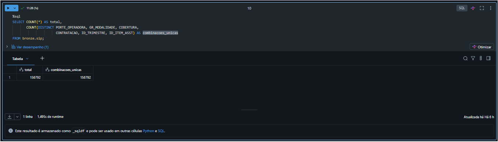

**Integridade da conversão de tipos**

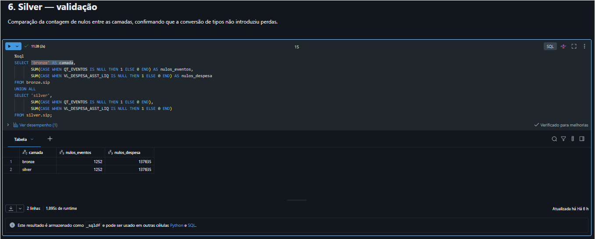

**Formatos numéricos divergentes**

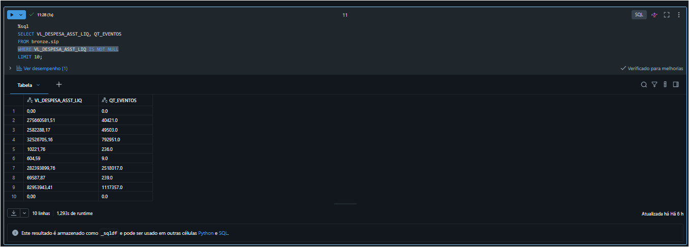

**Rastreabilidade da carga por nível hierárquico**

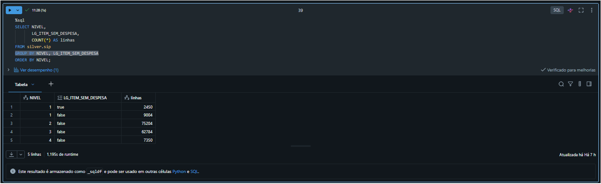

**Cobertura da classificação de exames**

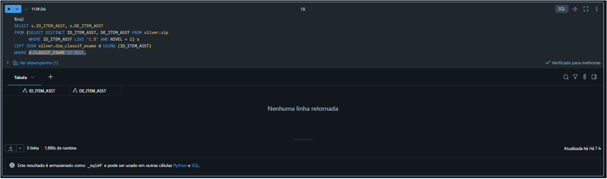

**Profundidade hierárquica por grupo**

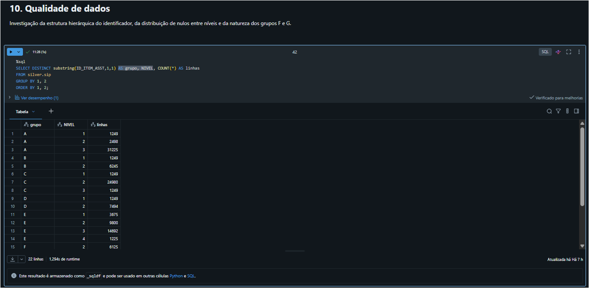

**Itens de nível 4**

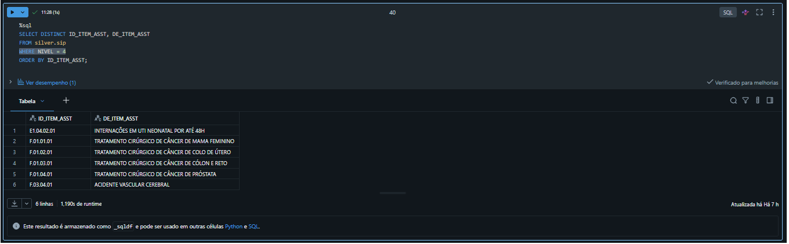

**Natureza dos grupos F e G**

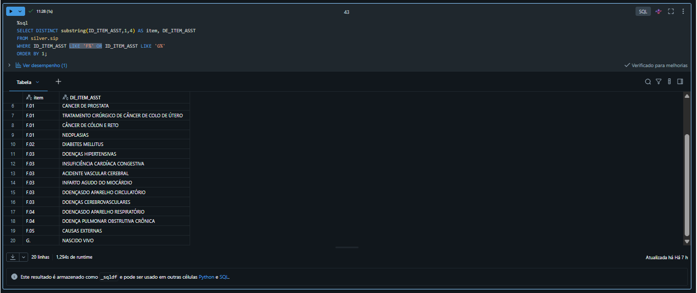

**Distribuição por natureza**

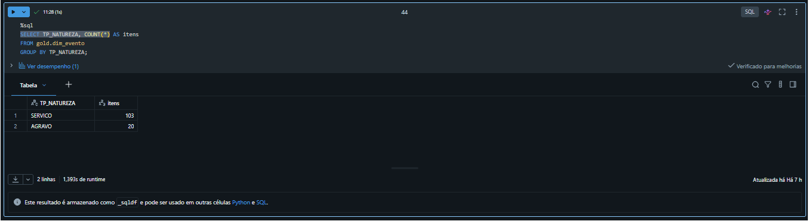

---

# 6. Análise de Dados (Etapa 4.5)

## Pergunta 3 — Quais tipos de evento concentram o maior volume de utilização?

```sql
SELECT e.DS_EVENTO, SUM(f.QT_EVENTOS) AS total_eventos
FROM gold.fato_custo f
JOIN gold.dim_evento e ON f.SK_EVENTO = e.SK_EVENTO
WHERE e.TP_NATUREZA = 'SERVICO'
GROUP BY e.DS_EVENTO
ORDER BY total_eventos DESC;
```

| Posição | Evento | Eventos | Participação |
|---|---|---|---|
| 1 | Exames | 6.459.093.320 | 60% |
| 2 | Consultas médicas | 1.552.234.173 | 14% |
| 3 | Procedimentos odontológicos | 1.102.350.125 | 10% |
| 4 | Outros atendimentos ambulatoriais | 1.069.208.953 | 10% |
| 5 | Terapias | 403.430.172 | 4% |
| 6 | Internações | 52.038.843 | 0,5% |

**Discussão:** exames respondem sozinhos por 60% do volume assistencial, superando a soma de todos os demais serviços e representando mais de quatro vezes o volume de consultas. A proporção é compatível com a prática clínica, em que uma consulta origina múltiplas solicitações de exame.

Procedimentos odontológicos ocupam a terceira posição, à frente de outros atendimentos ambulatoriais. Para um produto tratado como complementar, volume equivalente ao do núcleo ambulatorial indica utilização efetiva, e não apenas cobertura contratada.

## Pergunta 7 — Custo médio por evento

```sql
SELECT e.DS_EVENTO,
       SUM(f.QT_EVENTOS) AS eventos,
       ROUND(SUM(f.VL_DESPESA_ASST_LIQ)/1e9, 2) AS despesa_bi,
       ROUND(SUM(f.VL_DESPESA_ASST_LIQ)/NULLIF(SUM(f.QT_EVENTOS),0), 2) AS custo_medio
FROM gold.fato_custo f
JOIN gold.dim_evento e ON f.SK_EVENTO = e.SK_EVENTO
WHERE e.TP_NATUREZA = 'SERVICO'
GROUP BY e.DS_EVENTO
ORDER BY despesa_bi DESC;
```

| Evento | Eventos | Despesa (R$ bi) | Custo médio |
|---|---|---|---|
| Internações | 52.038.843 | 610,57 | R$ 11.732,92 |
| Exames | 6.459.093.320 | 275,60 | R$ 42,67 |
| Consultas médicas | 1.552.234.173 | 182,12 | R$ 117,33 |
| Terapias | 403.430.172 | 138,54 | R$ 343,41 |
| Outros ambulatoriais | 1.069.208.953 | 131,68 | R$ 123,15 |
| Demais despesas méd.-hosp. | — | 81,66 | — |
| Procedimentos odontológicos | 1.102.350.125 | 20,95 | R$ 19,01 |

**Discussão:** a ordenação por despesa inverte integralmente a ordenação por volume. Internações concentram 43% da despesa assistencial com 0,5% do volume, a um custo unitário 275 vezes superior ao de um exame — o que explica por que a gestão de risco no setor se organiza em torno da prevenção de internações.

O comportamento oposto aparece nos procedimentos odontológicos: volume equivalente ao de outros atendimentos ambulatoriais, despesa seis vezes menor e o menor custo unitário da série. A combinação de alta frequência com baixo custo unitário caracteriza serviço de exposição financeira reduzida e uso recorrente percebido.

## Pergunta 4 — Frequência por beneficiário exposto

$$\text{Frequência} = \frac{\sum \text{eventos}}{\sum \text{beneficiários fora de carência}}$$

| Evento | Frequência relativa |
|---|---|
| Exames | 5,45 |
| Procedimentos odontológicos | 1,40 |
| Consultas médicas | 1,29 |
| Outros atendimentos ambulatoriais | 0,90 |
| Terapias | 0,34 |
| Internações | 0,05 |

**Discussão:** normalizada pela exposição, a utilização odontológica supera a de consultas médicas. O denominador utiliza beneficiários fora do período de carência, e não a carteira total, evitando subestimar a frequência ao incluir beneficiários impedidos de utilizar o serviço.

## Perguntas 9 e 10 — Evolução da utilização

| Evento | 2020 | 2021 | 2022 | 2023 | 2024 | 2025 |
|---|---|---|---|---|---|---|
| Exames | 4,181 | 5,237 | 5,652 | 5,871 | 5,796 | 5,850 |
| Procedimentos odontológicos | 1,394 | 1,484 | 1,491 | 1,429 | 1,291 | 1,361 |
| Consultas médicas | 1,080 | 1,212 | 1,334 | 1,357 | 1,373 | 1,361 |
| Outros ambulatoriais | 0,740 | 0,803 | 0,905 | 0,980 | 0,984 | 0,979 |
| Terapias | 0,300 | 0,331 | 0,347 | 0,404 | 0,336 | 0,345 |
| Internações | 0,041 | 0,042 | 0,047 | 0,048 | 0,047 | 0,050 |

**Discussão:** a série apresenta padrão comum de recuperação seguida de estabilização. Exames crescem 25% entre 2020 e 2021 e estabilizam a partir de 2022. Consultas e atendimentos ambulatoriais seguem o mesmo comportamento, atingindo patamar em 2023.

O ano de 2020 é atípico pelo adiamento de procedimentos eletivos durante a pandemia, de modo que a variação 2020–2021 representa recuperação de demanda represada, e não crescimento estrutural. A estabilização posterior indica que essa demanda foi absorvida.

Procedimentos odontológicos são a única exceção: crescem até 2022, retraem 13% até 2024 e recuperam parcialmente em 2025, sem retornar ao patamar anterior.

## Desdobramento — Origem da retração odontológica

| Contratação | 2020 | 2021 | 2022 | 2023 | 2024 | 2025 | Pico→2024 |
|---|---|---|---|---|---|---|---|
| Individual ou familiar | 1,782 | 1,827 | 1,836 | 1,702 | 1,336 | 1,525 | **−27%** |
| Coletivo empresarial | 1,408 | 1,498 | 1,499 | 1,438 | 1,317 | 1,386 | −12% |
| Coletivo por adesão | 0,990 | 1,093 | 1,135 | 1,126 | 1,096 | 1,054 | **−3%** |

**Discussão:** a retração concentra-se na contratação individual. O coletivo por adesão mantém-se praticamente estável, com variação de 3% em seis anos.

A hierarquia de frequência é consistente em toda a série: individual acima de coletivo empresarial, que por sua vez está acima de coletivo por adesão. O padrão é compatível com seleção adversa — na contratação individual a decisão de compra é do próprio beneficiário, que tende a contratar quando antecipa necessidade de uso. No coletivo por adesão, a adesão ocorre no âmbito de uma entidade de classe, e parte dos beneficiários não exerce o uso.

Combinado ao custo unitário de R$ 19,01, o resultado indica que o produto odontológico no coletivo por adesão apresenta frequência baixa, previsível e exposição financeira reduzida.

## Pergunta 6 — Exames de imagem e laboratoriais

| Natureza | 2020 | 2021 | 2022 | 2023 | 2024 | 2025 | Crescimento |
|---|---|---|---|---|---|---|---|
| Imagem | 56,96 | 68,20 | 74,23 | 76,93 | 80,09 | 82,24 | +44% |
| Laboratorial | 19,43 | 24,14 | 26,59 | 28,79 | 30,61 | 32,53 | **+67%** |
| Funcional | 3,64 | 4,51 | 4,85 | 5,08 | 5,26 | 5,48 | +50% |
| Endoscópico | 3,25 | 3,87 | 4,57 | 5,19 | 5,12 | 5,34 | +64% |

*Valores em milhões de eventos.*

**Discussão:** exames laboratoriais apresentam o maior crescimento da série. Mais relevante que o acumulado é o ritmo: enquanto os exames de imagem desaceleram após 2022, mantendo média próxima a 3% ao ano, os laboratoriais sustentam entre 6% e 7% ao ano até 2025. A participação do laboratorial no total classificado sobe de 23,6% para 26,4%.

Uma hipótese compatível é a diferença de restrição de capacidade: exames de imagem dependem de equipamento e agenda, enquanto laboratoriais escalam com coleta. Os três procedimentos laboratoriais monitorados são exames de rastreamento, associados a programas de prevenção. A hipótese não é testável com os dados disponíveis e é registrada como interpretação.

## Discussão geral

O conjunto de análises converge para três conclusões sobre o problema original.

**Volume e custo são dimensões independentes.** A ordenação dos serviços por frequência de uso é praticamente o inverso da ordenação por despesa. Decisões de portfólio baseadas apenas em volume — ou apenas em custo — levam a conclusões opostas. O benchmark só é útil quando apresenta as duas dimensões conjuntamente.

**O canal de contratação explica mais que o serviço.** A frequência do mesmo produto odontológico varia 74% entre contratação individual (1,84) e coletivo por adesão (0,99). A diferença entre canais é maior que a diferença entre a maioria dos serviços. Qualquer benchmark de utilização que ignore o canal produz comparação inválida.

**O produto complementar apresenta perfil de risco distinto do núcleo.** Procedimentos odontológicos combinam frequência superior à de consultas médicas com custo unitário de R$ 19,01 — seis vezes menor que o de um atendimento ambulatorial e 617 vezes menor que o de uma internação. No coletivo por adesão, a variação da frequência em seis anos foi de apenas 3%. A combinação de uso recorrente, custo baixo e previsibilidade caracteriza exposição financeira reduzida, oferecendo referência de mercado para decisões de composição de portfólio.

## Evidência

**Pergunta 3 — volume de utilização por tipo de evento**

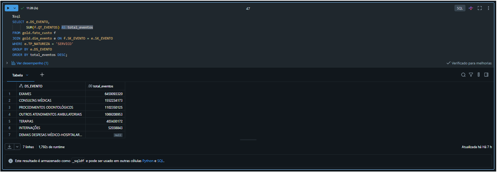

**Pergunta 7 — custo médio por evento**

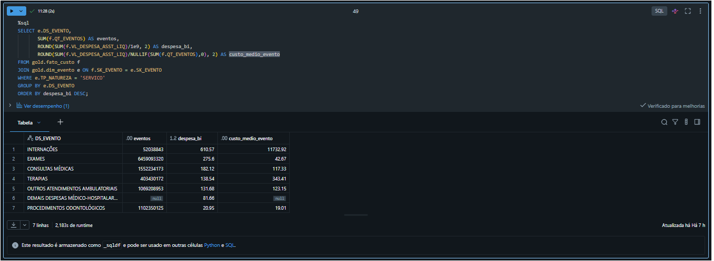

**Pergunta 4 — frequência por beneficiário exposto**

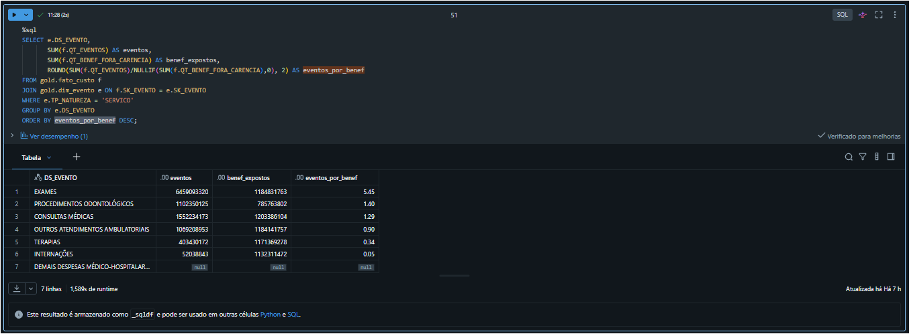

**Perguntas 9 e 10 — evolução anual**

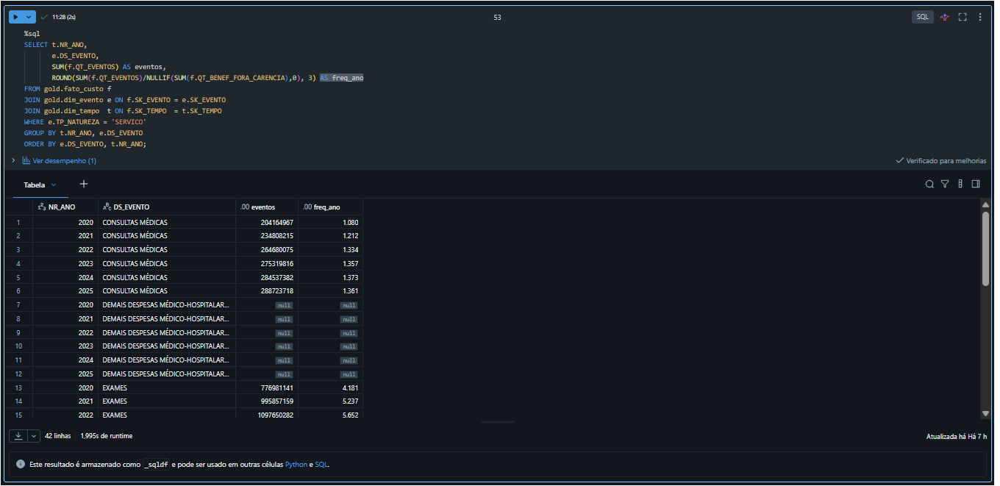

**Desdobramento — retração odontológica por canal**

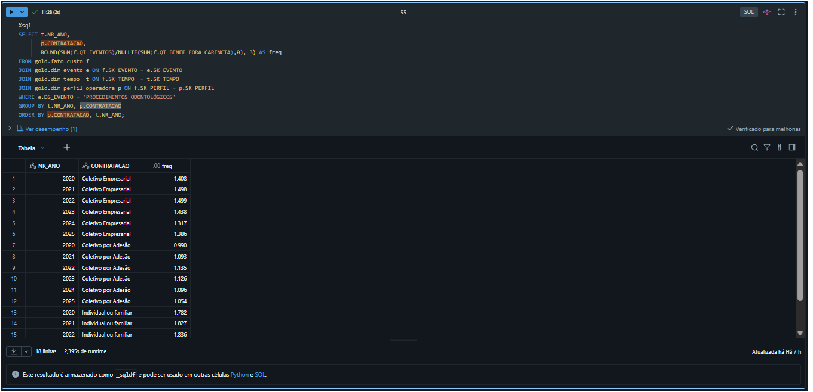

**Pergunta 6 — exames por natureza diagnóstica**

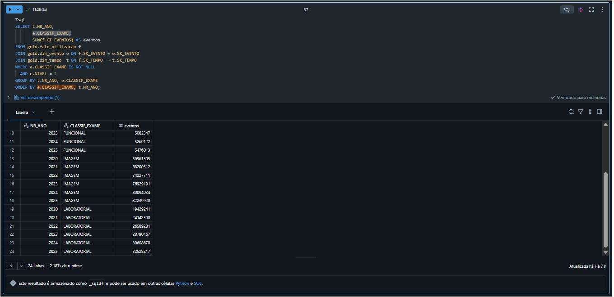

---

# 7. Autoavaliação

## Objetivos atingidos

Das onze perguntas formuladas na etapa de objetivo, **seis foram respondidas** — 3, 4, 6, 7, 9 e 10 — além de um desdobramento não previsto sobre a origem da retração odontológica por canal de contratação. Duas permanecem em aberto por limitação de tempo (5 e 8) e três não são respondíveis com a fonte escolhida (1, 2 e 11).

O pipeline foi construído integralmente: 24 arquivos ingeridos, 156.792 registros rastreados da origem ao modelo dimensional, cinco tabelas na camada analítica e integridade referencial verificada.

## Perguntas não respondidas e seus motivos

**Perguntas 1 e 2 — participação de mercado por operadora.** O SIP publica dados agregados por porte e modalidade, sem identificar operadoras individualmente. A informação existe em outra base da ANS (SIB — Sistema de Informações de Beneficiários), que foi investigada durante o trabalho: possui granularidade individual, com 27 colunas e cerca de 9 milhões de registros apenas para Minas Gerais, ocupando 11,4 GB em memória. A base não compartilha chave com o SIP além da dimensão temporal, o que produziria dois fatos desconectados no modelo. A decisão de não incorporá-la priorizou a profundidade da análise sobre a amplitude do escopo.

**Pergunta 11 — telemedicina.** A investigação da fonte indicou que a ANS trata telessaúde como modalidade de atendimento de procedimentos já cobertos, e não como serviço com registro estatístico próprio. O termo foi incluído na Tabela 50 da terminologia TISS a partir de 2020, mas não aparece no catálogo de itens assistenciais do SIP. Não se trata de limitação do pipeline, e sim de característica da política de dados do setor: um serviço central na estratégia comercial das operadoras não possui rastreabilidade pública.

Manter essas perguntas no documento, em vez de removê-las, preserva a integridade do planejamento inicial e explicita o que os dados públicos brasileiros permitem e não permitem investigar.

## Dificuldades encontradas

**A estrutura da fonte foi o principal obstáculo.** A hierarquia embutida no identificador do item assistencial não está documentada de forma explícita e só se revelou pela inspeção do padrão de códigos. Não detectá-la produziria contagens infladas em até três vezes, sem qualquer mensagem de erro. O mesmo vale para a coexistência de duas granularidades de medida na mesma tabela, que inicialmente se apresentou como 80% de dados faltantes e, investigada, mostrou-se regra de negócio.

**A distinção entre problema de dado e característica do dado exigiu método.** Em três ocasiões um sintoma que parecia falha — nulos de despesa, nulos de quantidade, grupos sem nível 1 — revelou-se comportamento esperado da fonte após decomposição. Interpretar esses casos como sujeira e aplicar limpeza teria descartado informação legítima.

**O dimensionamento inicial da plataforma estava incorreto.** A avaliação preliminar era de que o volume do SIP — 156.792 registros — não justificaria processamento distribuído, e que o uso do Databricks atenderia a requisito acadêmico mais que a necessidade técnica. A medição da base de beneficiários corrigiu esse diagnóstico: uma única unidade federativa ocupou 11,4 GB, tornando inviável o processamento local. A constatação mudou a compreensão sobre quando a nuvem deixa de ser conveniência e passa a ser requisito.

## O que faria diferente

Iniciaria a documentação em paralelo à construção, e não após. O registro estruturado dos achados de qualidade e das decisões técnicas só foi organizado depois que boa parte do pipeline já existia, o que exigiu reconstituir justificativas.

Também investigaria a estrutura hierárquica da fonte antes de definir o modelo dimensional. A separação em dois fatos foi consequência de uma descoberta feita durante a construção da camada gold — se identificada na exploração, teria evitado retrabalho.

## Trabalhos futuros

| Frente | Descrição |
|---|---|
| Análises pendentes | Frequência por modalidade de operadora (pergunta 5) e custo por beneficiário segundo o porte, testando a hipótese de ganho de escala (pergunta 8) |
| Comparação entre modelos de operação | Cooperativa odontológica contra odontologia de grupo, isolando o efeito do modelo societário sobre a utilização |
| Prevalência de agravos | Os grupos F e G, mapeados mas não explorados, permitem analisar a ocorrência de neoplasias, diabetes e doenças cardiovasculares por perfil de carteira |
| Incorporação do SIB | Ampliaria o escopo para participação de mercado, perfil demográfico e permanência, exigindo estratégia de ingestão compatível com o volume |
| Deflação da série | Aplicação de índice de preços permitiria separar crescimento real de crescimento nominal na despesa |
| Integração com dados demográficos do IBGE | Viabilizaria análise de penetração e cobertura por território |

## Considerações finais

O trabalho confirmou que a maior dificuldade em engenharia de dados não está na construção do pipeline, e sim na compreensão da fonte. As transformações implementadas são tecnicamente simples — conversões de tipo, derivação de colunas, filtros. O esforço concentrou-se em identificar por que os dados se comportavam de determinada maneira e em decidir o que constituía problema a corrigir e o que constituía regra a respeitar.

---

## Estrutura do repositório

```
.
├── README.md
├── notebooks/
│   ├── 00_exploracao.py
│   └── MVP_IsaiasCordeiro.py
├── docs/
│   ├── achados_qualidade_dados.md
│   ├── decisoes_tecnicas.md
│   └── resultados_analises.md
└── imagens/
    └── 24 screenshots de evidência
```
